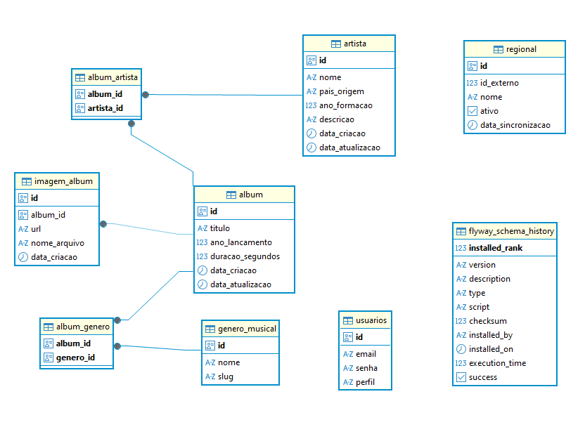

# Artist Manager API

## Informações Autorais

**Autor:** Carlos Rafael Nogueira de Arruda Silva

**Vaga:** Analista de Tecnologia da Informação - Perfil Engenheiro da Computação (Sênior)

**Projeto Escolhido:** Implementação Back End Java Sênior

## Sobre o Projeto

Desenvolvido para o Processo Seletivo Nº 001/2026/SEPLAG - Analista de Tecnologia da Informação (Engenheiro da Computação - Sênior)

Este projeto é uma API REST desenvolvida em **Java 21** com **Spring Boot 4.0.2** para gerenciamento de artistas, álbuns e gêneros musicais. A API oferece funcionalidades completas de CRUD, autenticação JWT, armazenamento de imagens em MinIO (S3-compatible), sincronização de dados externos, comunicação em tempo real via WebSocket e controle de taxa de requisições (Rate Limiting).


## Tecnologias Utilizadas

### Framework e Linguagem
| Tecnologia | Versão | Descrição |
| :--- | :--- | :--- |
| **Java** | 21 | Linguagem de programação |
| **Spring Boot** | 4.0.2 | Framework principal |
| **Spring Framework** | 7 | Base do Spring Boot 4 |

### Persistência de Dados
| Tecnologia | Versão | Descrição |
| :--- | :--- | :--- |
| **PostgreSQL** | 16 | Banco de dados relacional |
| **Spring Data JPA** | - | Abstração de acesso a dados |
| **Hibernate** | - | ORM (Object-Relational Mapping) |
| **Flyway** | - | Controle de versão de schema do banco de dados |

### Segurança e Autenticação
| Tecnologia | Descrição |
| :--- | :--- |
| **Spring Security** | Framework de segurança |
| **JWT** | Autenticação stateless (JSON Web Tokens) |
| **BCrypt** | Criptografia de senhas |

### Armazenamento de Arquivos
| Tecnologia | Versão | Descrição |
| :--- | :--- | :--- |
| **MinIO** | - | Object Storage compatível com S3 |
| **MinIO Java Client** | v8.5.7 | Cliente para comunicação com MinIO |

### Comunicação e Documentação
| Tecnologia | Versão | Descrição |
| :--- | :--- | :--- |
| **Spring WebMVC** | - | Framework web REST |
| **SpringDoc OpenAPI** | 3.0.1 | Documentação automática da API (Swagger UI) |
| **Spring WebSocket** | - | Comunicação em tempo real |
| **SockJS** | - | Biblioteca para WebSocket com fallback |

### Controle de Requisições
| Tecnologia | Versão | Descrição |
| :--- | :--- | :--- |
| **Bucket4j** | v8.7.0 | Algoritmo Token Bucket para Rate Limiting |

### Mapeamento de Objetos
| Tecnologia | Versão | Descrição |
| :--- | :--- | :--- |
| **MapStruct** | 1.5.5 | Geração automática de mappers DTO ↔ Entity |
| **Lombok** | - | Redução de boilerplate (getters, setters, construtores) |

### Validação
| Tecnologia | Descrição |
| :--- | :--- |
| **Jakarta Validation** | Validação de dados de entrada |

### Monitoramento e Saúde
| Tecnologia | Descrição |
| :--- | :--- |
| **Spring Boot Actuator** | Health checks e métricas |
| **Kubernetes Probes** | Liveness e Readiness probes |

### Testes
| Tecnologia | Versão | Descrição |
| :--- | :--- | :--- |
| **JUnit** | 5 | Framework de testes |
| **H2 Database** | - | Banco em memória para testes |
| **Spring Boot Test** | - | Utilitários de teste de integração |

### Infraestrutura
| Tecnologia | Descrição |
| :--- | :--- |
| **Docker** | Conteinerização da aplicação |
| **Docker Compose** | Orquestração de serviços |
| **Maven** | Gerenciamento de dependências e build |


## Orquestracao de Containers e Fluxo de Inicializacao

Este documento detalha a arquitetura definida no `docker-compose.yml`, explicando a ordem de dependência entre os serviços e o papel de cada container no ecossistema da aplicação.

### Fluxo de Inicializacao (Startup Order)

O `docker-compose` foi configurado com **Health Checks** e **condições de dependência** (`depends_on: service_healthy`) para garantir que a aplicação só inicie quando a infraestrutura base estiver pronta.

1. **Nivel 0 (Infraestrutura Base):**
* **`postgres`** e **`minio`** iniciam simultaneamente.
* O Docker monitora a saúde deles através dos `healthcheck` configurados (testando conexão via `pg_isready` e `curl` respectivamente).


2. **Nivel 1 (Configuracao e Seed):**
* Assim que o **`minio`** reporta status *healthy*, os containers **`minio-setup`** e **`createbuckets`** iniciam.
* Eles executam scripts para criar os *buckets* e popular o storage com imagens iniciais.


3. **Nivel 2 (Aplicacao):**
* O container **`api`** aguarda até que **`postgres`** E **`minio`** estejam saudáveis.
* Isso previne erros de conexão ao tentar iniciar o Spring Boot antes do banco ou do S3 estarem acessíveis.


### Volumes
* `postgres_data`: Garante que os dados do banco não sejam perdidos ao reiniciar o container.
* `minio_data`: Garante que os arquivos de upload persistam entre reinicializações.
* *Bind Mounts:* O serviço `minio-setup` monta pastas locais (`./seeds`) para injetar scripts e imagens dentro do container temporariamente.


### Rede (artist-network)
* Todos os containers estão na mesma rede `bridge`, permitindo que se comuniquem usando os nomes dos serviços como hostname (ex: a API chama o banco pelo nome `postgres` e não por IP).

## Arquitetura do Projeto Java

O projeto segue os princípios da **Arquitetura em Camadas (Layered Architecture)** e **Domain-Driven Design (DDD)**, organizando o código em pacotes bem definidos:

```
backend/src/main/java/br/com/carlos/artist_manager_api/
├── api/                          # Camada de Apresentação
│   ├── controller/              # Controllers REST
│   ├── dto/                     # Data Transfer Objects (Records)
│   └── mapper/                  # Mappers MapStruct
├── domain/                       # Camada de Domínio
│   ├── entity/                  # Entidades JPA
│   ├── repository/              # Interfaces de Repositório
│   └── service/                 # Lógica de Negócio
├── infrastructure/              # Camada de Infraestrutura
│   ├── config/                  # Configurações (Security, MinIO, WebSocket, etc.)
│   ├── security/                # Filtros de Segurança
│   └── service/                 # Serviços de Infraestrutura (Storage)
└── util/                        # Utilitários
```

### Descrição das Camadas

#### 1. **Camada API (Apresentação)**
- **Controllers**: Recebem requisições HTTP, validam entrada, delegam para serviços e retornam respostas
- **DTOs**: Objetos imutáveis (Records) que representam o contrato da API, separando o modelo de domínio da interface externa
- **Mappers**: Interfaces MapStruct que convertem automaticamente entre DTOs e Entidades

#### 2. **Camada Domain (Domínio)**
- **Entities**: Modelos de domínio anotados com JPA, representando as tabelas do banco
- **Repositories**: Interfaces Spring Data JPA que abstraem acesso a dados
- **Services**: Contêm a lógica de negócio, orquestram operações e garantem regras de negócio

#### 3. **Camada Infrastructure (Infraestrutura)**
- **Config**: Classes de configuração do Spring (@Configuration)
- **Security**: Filtros customizados (JWT, Rate Limiting)
- **Service**: Implementações de serviços de infraestrutura (ex: MinIO Storage)

#### 4. **Util**
- Classes utilitárias auxiliares (ex: GeradorSenha para desenvolvimento)

##  Banco de Dados 

### Schema do Banco de Dados




### Configuração do MinIO

- **Endpoint**: `http://localhost:9000` (API) / `http://localhost:9001` (Console)
- **Bucket**: `capas-albuns`
- **Política**: Público para download (configurado via script `init-minio.sh`)
- **Setup Automático**: Container `minio-setup` cria bucket e faz upload de imagens seed

---

## Atendimento aos Requisitos Tecnicos

Abaixo detalho como cada requisito do edital foi tecnicamente implementado na solucao, demonstrando as decisoes de arquitetura adotadas no codigo.

## 1. Requisitos Gerais

### a) Seguranca: bloquear acesso ao endpoint a partir de dominios fora do servico

**Implementacao:** Na classe `SecurityConfig`, foi configurado o metodo `corsConfigurationSource`. Definimos explicitamente as origens permitidas (ex: `http://localhost:3000`) e bloqueamos requisicoes de outras origens, garantindo que apenas clientes confiaveis consumam a API.

### b) Autenticacao JWT com expiracao a cada 5 minutos e renovacao

**Implementacao:**

* **Expiracao:** O `JwtService` gera tokens com validade de 300 segundos (5 minutos), configurado via `application.properties`.
* **Renovacao:** Foi criado o endpoint `/v1/auth/refresh-token` no `AuthController`. Ele valida o *Refresh Token* (validade longa) e emite um novo *Access Token* sem exigir que o usuario informe as credenciais novamente.

### c) Implementar POST, PUT, GET

**Implementacao:** Os controladores de dominio (`AlbumController`, `ArtistaController`, `GeneroController`) implementam as operacoes completas utilizando `@PostMapping` para cadastro, `@PutMapping` para atualizacao e `@GetMapping` para consultas. O `RegionalController` utiliza `@PostMapping` especifico para o disparo da acao de sincronizacao.

### d) Paginacao na consulta dos albuns

**Implementacao:** O endpoint de listagem recebe um objeto `Pageable` do Spring Data. Isso permite passar parametros como `?page=0&size=10` na URL. O retorno e um objeto `Page<AlbumResponse>`, contendo os dados e metadados de paginacao otimizados pelo banco.

### e) Consultas parametrizadas (Cantores/Bandas)

**Implementacao:** O metodo de listagem aceita parametros opcionais (`@RequestParam`). A camada de servico utiliza `Specification` (JPA) para filtrar dinamicamente, retornando apenas albuns que possuam os artistas ou relacionamentos especificos solicitados.

### f) Consultas por nome com ordenacao alfabetica

**Implementacao:** O objeto `Pageable` suporta ordenacao nativa. Configuramos o padrao com `@PageableDefault(sort = "nome")`. O cliente pode alterar a direcao passando `?sort=nome,desc` ou `asc`.

### g) Upload de imagens de capa

**Implementacao:** O endpoint foi configurado para consumir `multipart/form-data`. O metodo no controller recebe uma `List<MultipartFile>`, permitindo o upload simultaneo de multiplos arquivos, que sao processados e enviados para o storage.

### h) Armazenamento no MinIO (S3)

**Implementacao:** Utilizamos o MinIO rodando em container Docker. O `FileStorageService` utiliza o SDK AWS/MinIO para enviar o fluxo de bytes dos arquivos para o bucket `capas-albuns`, salvando no banco de dados apenas a referencia (chave) do arquivo.

### i) Links pre-assinados com expiracao de 30 minutos

**Implementacao:** Por seguranca, o bucket nao e publico. No momento da consulta (`GET`), a API gera dinamicamente uma *Presigned URL* valida por 30 minutos utilizando o cliente S3, permitindo acesso temporario e seguro a imagem.

### j) Versionar endpoints

**Implementacao:** Todos os controladores foram anotados com o prefixo `/v1` no `@RequestMapping` (ex: `/v1/albuns`), garantindo que a API possa evoluir para v2 sem quebrar contratos existentes.

### k) Flyway Migrations para criar e popular tabelas

**Implementacao:** A dependencia `flyway-core` gerencia o versionamento do banco de dados. Os scripts SQL (`V1__criar_tabelas.sql`, `V2__inserir_dados_iniciais.sql`, `V3__inserir_usuarios_padrao.sql`) sao executados automaticamente na inicializacao para criar a estrutura do schema, inserir cargas iniciais (lookups) e usuarios padrao.

### l) Documentar com OpenAPI/Swagger

**Implementacao:** Integramos o `springdoc-openapi`. Utilizamos anotacoes como `@Operation` e `@ApiResponse` nos controladores para descrever os endpoints, gerando a interface visual do Swagger UI acessivel em `/swagger-ui.html`.

## 2. Requisitos Apenas para Senior

### a) Health Checks e Liveness/Readiness

**Implementacao:** Habilitamos o *Spring Boot Actuator* e as sondas Kubernetes no `application.properties`. Isso expoem os endpoints `/actuator/health/liveness` (para reiniciar containers travados) e `/actuator/health/readiness` (para gerenciar trafego na inicializacao), usados tambem no `docker-compose`.

### b) Testes unitarios

**Implementacao:** Utilizamos **JUnit 5** e **Mockito**. A classe `AlbumServiceTest` isola a camada de servico, mockando repositorios e dependencias externas para validar regras de negocio (ex: calculo de dados, lancamento de excecoes) sem depender do banco de dados.

### c) WebSocket para notificacao em tempo real

**Implementacao:** Configuramos um servidor STOMP/SockJS em `/ws`. No `AlbumController`, apos salvar um album, utilizamos o `SimpMessagingTemplate` para enviar o objeto criado ao topico `/topic/albuns`, atualizando instantaneamente os clientes conectados.

### d) Rate limit: 10 requisicoes/min por usuario

**Implementacao:** Implementamos o algoritmo *Token Bucket* com a biblioteca `Bucket4j`. Um filtro (`RateLimitFilter`) intercepta requisicoes autenticadas e consome tokens de um balde em memoria associado ao usuario. Se o limite exceder, retorna erro `429 Too Many Requests`.

### e) Endpoint de regionais (Sincronizacao)

**i) Importar lista:**
O `RegionalSyncService` utiliza `RestClient` para consumir o JSON da API externa (`integrador-argus-api`) e converte-lo para DTOs internos.

**ii) Adicionar atributo "ativo":**
A entidade `Regional` foi modelada com os campos `id_externo` (vinculo com API), `ativo` (controle logico) e `data_sincronizacao`.

**iii) Sincronizar com menor complexidade (Logica O(N)):**
Para evitar lentidao com multiplas consultas ao banco, a logica foi implementada em memoria:

1. Carrega-se todo o banco atual em um `Map`.
2. Itera-se a lista externa.
3. **Novo:** Se nao existe no Map, insere como ativo.
4. **Alterado:** Se existe mas mudou dados, inativa o registro antigo (preservando historico) e cria um novo ativo.
5. **Ausente:** Registros que sobraram no Map (nao vieram na API) sao inativados.
6. Tudo e salvo em lote com `saveAll`.
---

## Como Executar o Projeto

### Pré-requisitos
- Docker e Docker Compose instalados
- Portas livres: `8080` (API), `5433` (PostgreSQL), `9000/9001` (MinIO)

### Execução Completa

```bash
# Na raiz do projeto
docker-compose up -d --build
```

Este comando irá:
1. Construir a imagem da API (multistage build)
2. Subir PostgreSQL na porta 5433
3. Subir MinIO nas portas 9000/9001
4. Executar script de setup do MinIO (cria bucket e faz upload de imagens)
5. Executar migrations do Flyway
6. Iniciar a API na porta 8080

### Acessos

- **API**: http://localhost:8080
- **Swagger UI**: http://localhost:8080/swagger-ui.html
- **MinIO Console**: http://localhost:9001 (usuário: `minioadmin`, senha: `minioadmin`)
- **Health Check**: http://localhost:8080/actuator/health

### Usuários Padrão

- **Admin**: `admin@example.com` / `admin123`
- **User**: `user@example.com` / `user123`

### Testes

```bash
# Executar testes unitários e de integração
cd backend
./mvnw test
```

---
